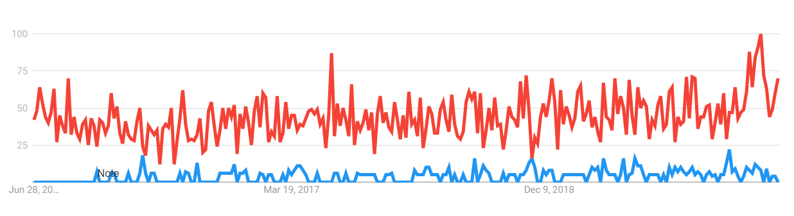

```{r global_options, echo=FALSE}
knitr::opts_chunk$set(echo=FALSE, warning=FALSE, message=FALSE)
```

```{r libraryLoading}
library(twitteR)
library(NLP)
library(tm)
library(tidytext)
library(rtweet)
library(dplyr)
library("SnowballC")
library("wordcloud")
library("RColorBrewer")
library(udpipe)
library(lattice)
library(lda)
library(MASS)
library(caret)
library(htmltools)
library(klaR)
library(sentimentr)
library("syuzhet")
library(randomForest)
library(topicmodels)
library(ggplot2)
```

# INTRODUCTION: #

&nbsp;&nbsp;&nbsp;“Veganism” - the term has been trending a lot worldwide since the last few years. With the increase in the number of vegans worldwide due to various reasons along with renowned celebrities jumping on the bandwagon has proved to be a great influencer for adopting veganism or has at least got us to thinking about the reasons for these conversions. We are probably on the forefront of one of the biggest food revolutions to take place in the world. According to the Plant Based Food Association, there has been a 31% rise in the sales of plant based food products since 2017 and the valuation for this industry has spiked up to $4.5 billion. [1] Important questions to be answered here are - is this a fad or a mass healthy transition, the top reasons for this transition, effects of this transition, whether this will prove beneficial for us in the long run, etc.  
&nbsp;&nbsp;&nbsp;While studying the causes for the rise in the number of vegans, we realised that understanding the attitude and perception of people adopting veganism is the most crucial part. To achieve this, tracking the social media activities of users would play an important role like tweets, posts, stories, etc. Sentiment analysis is a useful method to analyse the sentiment of an user while tweeting about an issue. While reading tweets about veganism - #vegan, #veganlife , a nice mix of tweets showcasing vegan recipes, benefits of veganism, hatred for animal abuse, advantages of a healthy lifestyle, creating awareness about environmental issues, criticising meat lovers, etc. were observed. Interestingly, there were substantial #antivegan tweets which aimed at mocking or humiliating the vegan community. Thus, studying both the groups could give us deeper insights about understanding the ‘vegan minds’.  
 
# MOTIVATION: #

&nbsp;&nbsp;&nbsp;The primary reasons for switch to veganism as identified by a number of surveys are - Healthy Lifestyle, Animal Welfare, Environment conservation, Taste, etc.[2] According to reports[3], the production rate in just the U.S. for meat increases by 2-3% on an average every year and the global valuation for this sector is over $2 trillion, so we can clearly say that this is indeed a huge business! Although it can be seen that meat production has been on a rise for the past many decades, will it be the same in the coming decades too? Factors which prove to be game changers for the vegan industry and have been on a rise are adapting these trends like “transitioning to a vegan lifestyle” due to the animal abuse done in the meat industry, consumers converting themselves to being “strictly vegetarians” due to harmful effects of animal consumption like cardiovascular diseases, pandemics which spread from animals and difficulties in digestion, rise in production of cheaper but similar food alternatives, etc. The revolutionary petitions and protests done by animal activists to encourage people to stop eating meat have had a significant effect on the consumption rate. Also, meat production is a major contributor to water and air pollution, biodiversity loss, etc.  
We can definitely conclude that veganism has a lot of benefits on a personal as well as a global level and studying the perceptions of people following it country wise, gender wise, their rationales behind adapting it can help us make well informed decisions to choose our lifestyle in the near future. As they say, slow and steady always wins, ‘veganism’ is definitely a slow and steadily rising trend! A sentiment analysis model on #vegan tweets, ‘vegan’ search data on Google, #vegan data from other social networking platforms will help understand the attitude behind veganism which is our main motive behind building this system.


# PROBLEM STATEMENT: #

&nbsp;&nbsp;&nbsp;The purpose of this project is to deeply understand the perceptions of people practising “veganism” as an attitude. Parsing the tweets, we are characterizing them into different clusters based on the similarity in their content. Our system will further provide sentiment analysis functionality to classify tweets into categories like - health/plant based or animal based tweets OR positive, negative or neutral. Later, emotion analysis on these tweets to identify emotions in depth (anger, sadness, joy,etc.) is done to get a better understanding.  Also we find interesting trends in  veganism/anti-veganism on twitter in different countries. We have been working to collect data every 7 days to improve our model and gain more insights for our decided categories.


# PROPOSED METHODOLOGIES (ALGORITHMS): #

&nbsp;&nbsp;&nbsp;The main motive of this project is to perform sentiment analysis on tweets to understand the perception of the vegan population. Thus, the model has to be a classification model as it should classify tweets into different categories like animal cruelty / health lifestyle which could help us in analysing the reason for people following veganism. The dataset has location information as well so we can find the most common reason for people in a country to follow veganism.

The candidate core algorithms which we think would be beneficial to build our model are:

1.  Support vector machine: 
Being one of the most common algorithms to be used for classification, SVM can perform quite well when used for sentiment analysis. The hyperplane formed is such that it is quite far distant from the two classes in which we have to classify data, being linear classifier in nature. There are possibilities of creating a non-linear SVM classifier too using some new kernel but we have to test if they can perform better then the linear SVM because there is a trade-off of using it since it increases generalization error due to high dimensional space.

2. Naive Bayes: 
Naive Bayes which is a probabilistic classifier based on Bayes’ theorem is another basic approach used for sentiment analysis. The benefit of using this classifier is that it requires a comparatively small amount of training data to estimate the parameters which are required for classification. The assumption used is that every word is independent of others, which is not quite true because words do depend on previous words but this assumptions eases up the math and works well practically. 

3. Decision Tree:
Decision Trees and Random Forest are another basic approach used for sentiment analysis which often performs satisfactory. We give an annotated training data to the model and for text it maps different words with classes to build trees.

4. Word2vec:
Neural networks being widely used in many applications can also be used for sentiment analysis. Word2vec is a two-layered neural network which uses the approach of processing text by vectorizing words. It functions by grouping the vectors of similar words together in vectorspace. It can use past appearances of words to make highly accurate guesses about a word’s meaning. Skip-gram is an approach in which a word is used to predict a target context when using word2vec. Skip-gram is a modified version of n-grams in which items are dropped from n-grams to generate more generalized contexts.


# DATA LOADING AND CLEANING #  

All the datasets require cleaning and processing first. Cleaning for this data was done where http://, punctuations, digits,emoticons,english stopwords, etc, were removed. The corpus generated contains just important and meaningful parts of speech after cleaning. By retaining only the meaningful parts of speech, performing analytics becomes easier and helps better processing of the natural language which users use in their tweets. Detailed description of datasets is given below. 


```{r dataCleaning and Loading}
vegan <- read.csv("vegan.csv", na.strings = "?", header = T, stringsAsFactors=TRUE)
vegan$text = gsub("&amp", "", vegan$text)
vegan$text = gsub("(RT|via)((?:\\b\\W*@\\w+)+)", "", vegan$text)
vegan$text = gsub("@\\w+", "", vegan$text)
vegan$text = gsub("[[:punct:]]", "", vegan$text)
vegan$text = gsub("[[:digit:]]", "", vegan$text)
vegan$text = gsub("http\\w+", "", vegan$text)
vegan$text = gsub("[ \t]{2,}", "", vegan$text)
vegan$text = gsub("^\\s+|\\s+$", "", vegan$text)
vegan$text <- iconv(vegan$text, "UTF-8", "ASCII", sub="")

antivegan <- read.csv("antivegan.csv", na.strings = "?", header = T, stringsAsFactors=TRUE)
antivegan$text = gsub("&amp", "", antivegan$text)
antivegan$text = gsub("(RT|via)((?:\\b\\W*@\\w+)+)", "", antivegan$text)
antivegan$text = gsub("@\\w+", "", antivegan$text)
antivegan$text = gsub("[[:punct:]]", "", antivegan$text)
antivegan$text = gsub("[[:digit:]]", "", antivegan$text)
antivegan$text = gsub("http\\w+", "", antivegan$text)
antivegan$text = gsub("[ \t]{2,}", "", antivegan$text)
antivegan$text = gsub("^\\s+|\\s+$", "", antivegan$text)
antivegan$text <- iconv(antivegan$text, "UTF-8", "ASCII", sub="")

total <- read.csv("total.csv", na.strings = "?", header = T, stringsAsFactors=TRUE)
total$text = gsub("&amp", "", total$text)
total$text = gsub("(RT|via)((?:\\b\\W*@\\w+)+)", "", total$text)
total$text = gsub("@\\w+", "", total$text)
total$text = gsub("[[:punct:]]", "", total$text)
total$text = gsub("[[:digit:]]", "", total$text)
total$text = gsub("http\\w+", "", total$text)
total$text = gsub("[ \t]{2,}", "", total$text)
total$text = gsub("^\\s+|\\s+$", "", total$text)
total$text <- iconv(total$text, "UTF-8", "ASCII", sub="")

google <- read.csv("riseInVeganism.csv", na.strings = "?", header = T, stringsAsFactors=TRUE)

labelleddata <- vegan[c(1:1050),]

uncleanedVegan <- read.csv("uncleanedvegan.csv", na.strings = "?", header = T, stringsAsFactors=TRUE)

kmeanstest <- read.csv("kmeanstest.csv", stringsAsFactors = T, na.strings = "?", header = T)
kmeanstest$text = gsub("&amp", "", kmeanstest$text)
kmeanstest$text = gsub("(RT|via)((?:\\b\\W*@\\w+)+)", "", kmeanstest$text)
kmeanstest$text = gsub("@\\w+", "", kmeanstest$text)
kmeanstest$text = gsub("[[:punct:]]", "", kmeanstest$text)
kmeanstest$text = gsub("[[:digit:]]", "", kmeanstest$text)
kmeanstest$text = gsub("http\\w+", "", kmeanstest$text)
kmeanstest$text = gsub("[ \t]{2,}", "", kmeanstest$text)
kmeanstest$text = gsub("^\\s+|\\s+$", "", kmeanstest$text)
kmeanstest$text <- iconv(kmeanstest$text, "UTF-8", "ASCII", sub="")

```

## DATASETS ## 

The rtweet api allows us to fetch tweets with 90 columns for each tweet but we have extracted 15 columns which we found could be useful for our analysis namely: location, user_id, status_id, created_at, screen_name, text, source, retweet_count, country, country_code, name, hashtags, bbox_coords, coords_coords, geo_coords. 
We have segregated the tweets in two files to do analysis on tweets related to veganism and anti-veganism separately, but in some analysis we have combined the data from two tables to do comparison between their data.


Vegan data (vegan.csv):
This data contains tweets having #vegan mentioned in it. This dataset contains a distinct number of tweets without considering the retweeted tweets with above mentioned 15 columns data.
https://drive.google.com/file/d/1DEucE4NZG2EGPcJ23pC5111nE5H6a3Yd/view?usp=sharing

Anti - Vegan data (antivegan.csv):
This data contains tweets having #antivegan mentioned in it. This dataset contains a distinct number of tweets without considering the retweeted tweets with above mentioned 15 columns data.
https://drive.google.com/file/d/1-PNtABTm-sUsP1h6cIqei1GVhi917VMe/view?usp=sharing

Combined data (total.csv):
This data contains mixed data of both #vegan and #antivegan in it. 
This dataset contains cleaned and preprocessed corpus on which we are working. 
The total number of rows, i.e. the distinct number of tweets without considering the retweeted tweets in this dataset are - 
```{r number of rows1}
n <- nrow(total)
n
```

Entire data (uncleanedvegan.csv):
This data contains all the tweets having #vegan mentioned in it. This dataset is in the raw state before it was cleaned and preprocessed. The total number of rows, i.e. the number of tweets considering retweets in this dataset are - 
```{r number of rows}
n <- nrow(uncleanedVegan)
n
```


Rise in Veganism (Google dataset) (riseInVeganism.csv):

The data collected was taken from Google Trends for ‘Number of searches’ - vegan..
It contains monthly data from the year 2004 - 2020. 
https://drive.google.com/file/d/1nWFMMocqku5ycmyYE1hOAXHMctmKqDba/view?usp=sharing

# RISE IN VEGANISM #

The graph plotted shows that search has been on a steady rise since 2004. The scale is a relative measure. The highest number of searches is assigned 100 and the rest are relative to this 100 value. For every year after 2014, we see a sudden rise/peak for the month of January. This can be due to the celebration of “Veganuary”- a campaign which promotes veganism by encouraging people to follow a vegan lifestyle for January. 

```{r RiseInVegan}
ggplot(data = google, aes(x = Month, y = vegan)) +
  geom_point() +
  labs(x = "Time",
       y = "Google Search",
       title = "Rise In Veganism",
       subtitle = "Monthly Google Search for 'Vegan' (2004-2020)")
```


#PROBABILITY OF RETWEETS#

&nbsp;&nbsp;&nbsp;The number of anti vegan and vegan tweets is not equal. Hence, we calculated the percentage for the number of retweets for ‘vegan’ and ‘anti vegan’ tweets respectively. The bar graph plotted shows that #vegan tweets are less retweeted, just 13% of the tweets are retweeted while for the #antivegan tweets, 85% of the tweets are retweeted. Vegans are more innovative and are trying to show a variety of food recipes, express their thoughts to tell people about the benefits or importance of transitioning to veganism. Large vegan communities are actively posting tweets and since vegan recipes/thoughts are new and to popularise the trend people might be frequently posting their personal thoughts rather than reposting. While on the other hand the anti-vegan community is not very large in number, so drawing powerful conclusions about them would not be accurate. Also, there were a substantial number of tweets where people are celebrating a barbeque dinner with friends and tagging their friends who tend to retweet the tweets in which they are tagged. This can be one reason for the high amount of retweets.

```{r BarChart}
col <- vegan[,c("retweet_count")]
col[col > 0] <- 1 

anticol <- antivegan[,c("retweet_count")]
anticol[anticol > 0] <- 1 
vegantrue = (sum(col) / 51594) * 100
veganfalse = 100 - vegantrue
antivegantrue = (sum(anticol) / 122) * 100
antiveganfalse = 100 - antivegantrue
data <- data.frame(vegan = c(vegantrue, veganfalse), antivegan = c(antivegantrue, antiveganfalse))
data <- data.frame(label=c("retweeted","retweeted","not_reweeted","not_reweeted"),tweet_type = c("vegan","antivegan","vegan","antivegan"),percent = c(data[1,1],data[2,1],data[1,2],data[2,2]))
ggplot(data=data, aes(x=tweet_type, y=percent, fill=label)) +
  geom_bar(stat="identity")
```

# MEAT BASED SALE VS PLANT-BASED SALE #

Meat sale vs plant based sale shows that meat sale is always significantly higher than plant based products sales. Also the plot shows that there are more variations in meat sales over a period of time as compared to plant based sales. A surprising inference from the plot is that after the spread of COVID-19 the meat sale has dramatically increased whereas the plant based sales stays almost the same. The graph shown here is taken from Google Trends page.[10](https://trends.google.com/trends/?geo=US)


```{r pressure, echo=FALSE, fig.cap="Meat sales vs Plant-based sales", out.width = '100%'}

```

# DENSITY MAP PLOTS FOR TWEET LOCATION AND USER LOCATION #

Using the ggplot2 package, we have plotted a map for ‘user location’. The higher number of points accumulated in the United States and United Kingdom, Germany tell us about the growing popularity of this trend in these locations. Sales for plant based products at these locations is also on a high.[1] Thus, we can say that the users data plotted is somewhat right even if we do not have enough locations or coordinates data available considering all the tweets data. The locations are difficult to access and depend on the user’s will to share their locations. Hence, maps plotted may not be highly accurate.


There are two types of locations available for tweets data - the ‘tweet location’ and the ‘user location’ . The  ‘tweet location’ specifies the location for that tweet given by the user which can be any random place as well. The ‘user location’ are the location coordinates where the user is based in. The data used for plotting the user locations is the “Entire data” which includes retweets as well. 
The plot shows that countries like the United Kingdom, United States of America, Holland, Germany, Italy are leading locations for posting tweets related to veganism. Followed by these countries are Canada, Brazil, India and Japan to name a few. From this we can say that - 
1. People at these locations are more ‘social media butterflies’, i.e. people who tend to post a lot about their daily lives regularly.
2. People at these locations are hard core vegan influencers and encouraging supporters of their vegan community. Maybe, influential vegans can be based in these locations or people who run popular vegan campaigns, organisations can be from these locations. 


```{r WorldMap, fig.cap="World map plot for user locations", out.width = '100%'}
data <- uncleanedVegan[, c("geo_coords")]
data <- do.call("rbind", strsplit(as.character(trimws(data))," +",fixed=FALSE))
data <- as.data.frame(data)
data[data == 'NA'] <- NA
data <- data  %>% na.omit()
world_map <- ggplot() + borders("world", colour = "gray85", fill="gray80")
data$V1 <- as.numeric(data$V1)
data$V2 <- as.numeric(data$V2)

data <- as.data.frame(data)

world_map + geom_point(data = data, aes(x = V2 , y = V1)) +
  scale_size_continuous(range = c(1, 8), breaks=c(0, 250, 500, 1000))
```


# WORD CLOUDS #

There are two word clouds generated for our data.
One is based on the tweet text column and the other is made on the hashtags column.
The word clouds generated state that there is similar frequency for the presence of a few prominent words. The hashtags word cloud shows words like - ‘plant based’ , ‘cruelty free’, ‘healthy’, ‘natural’ ,etc. While the other word cloud has been made on a cleaned data corpus. Both have words belonging to our main two categories.
For example, ‘healthy’, ‘natural’, ‘organic’ can be health related while  ‘cruelty free’, ‘animal rights’, ‘end speciesism’, etc. are animal related.


```{r WordCLoud}
text_corpus <- Corpus(VectorSource(vegan$text))

text_corpus <- tm_map(text_corpus, tolower)

text_corpus <- tm_map(text_corpus, removeWords, stopwords("english"))
text_corpus <- tm_map(text_corpus, removeWords, c("vegan", "veganuary", "crueltyfree", 
"plantbased", "animals", "animal", "animalrights", "vegetarian", "govegan", "glutenfree", 
"veganfood", "food", "will", "can", "know", "one", "make", "go", "just", "like", "need", "cats", "caturday", "catsoftwitter", "catsofinstagram", "dont","new"))
set.seed(5)
wordcloud(text_corpus,min.freq=1,max.words=80,scale=c(2.2,1), colors=brewer.pal(8, "Dark2"),random.color=T, random.order=F)

```
```{r hashtag}

vegan$hashtags <- iconv(vegan$hashtags, "UTF-8", "ASCII", sub="")
text_corpus <- tm_map(text_corpus, tolower)

text_corpus <- tm_map(text_corpus, removeWords, stopwords("english"))
text_corpus <- tm_map(text_corpus, removeWords, c("vegan", "<u+30d3><u+30fc><u+30ac><u+30f3>"))
set.seed(1)
wordcloud(text_corpus,min.freq=1,max.words=60,scale=c(2.2,1), colors=brewer.pal(8, "Dark2"), random.color=T, random.order=F)
```

# FREQUENCY OF VERBS #

&nbsp;&nbsp;&nbsp;The barchart shown below depicts the most frequently used verbs in tweets which can help us in knowing the activity included in the tweets of users and how it can be related to veganism. From our plot, we can see “made” is the most frequently used verb. It can be said that people post more about dishes which they have probably made. Tweets related to food are more in general as we can see other frequent words like “eating”, “grilling”, “fried”. 

```{r verbs}
model <- udpipe_download_model(language = "english")
model
udmodeleng <- udpipe_load_model(file = 'english-ewt-ud-2.4-190531.udpipe')
annotate <- udpipe_annotate(udmodeleng, total$text)
dataann <- data.frame(annotate)
ver <- subset(dataann, upos %in% c("VERB"))
verb <- txt_freq(ver$token)
verb$key <- factor(verb$key, levels = rev(verb$key))
barchart(key ~ freq, data = head(verb, 20), col = "blue", main = "Frequency of verbs" , xlab = "freq")
```

# CANDIDATE ALGORITHMS TESTING : #  
  
## ANALYSIS : ##  

### TOPIC MODELLING ###


Clustering is a powerful tool for detecting categories in text corpus. For our large dataset, getting these hidden categories will be very useful for choosing our classes as getting labelled vegan data is a tedious task. Unlike topic classification, topic modelling does not require training to be done on data and is capable of finding the hidden similarities in the data provided. Hence, for this we are performing unsupervised clustering on our data using -


1.   Latent Dirichlet Allocation (LDA)
	For analytics on the tweets’ textual corpus, we performed the Latent Dirichlet Allocation (LDA) used in natural language processing which allows us to break our textual document into smaller sub topics which are similar to each other. Here in this unsupervised technique by specifying the ‘k value’, we can define higher level groupings in our corpus. For our analysis, we experimented with multiple k values. For k = 4, which divided the frequently occurring similar words into four categories. The corpus formed for the data included a mix of ‘#vegan’ and ‘#antivegan’ tweets data.
The words generated for the four topics keep changing on every run due to randomly sampled corpus setting a seed is not enough here. The common trait in every set of generated 4 topics was -
One topic usually has words like ‘healthy’, ‘veganism’, ‘protein’, ‘diet’, etc. , 
Another topic has words like ‘bbqlovers’, ‘beef’, ‘pork’, ‘meatporn’, etc. ,
While the other two topics are a mix of words from the above mentioned topic. The distinction is quite clear always.
These set of words help us understand that tweets related to veganism are classified mainly into two groups namely - ‘Health related’ and ‘Animal related’. Hence, we decided to perform another clustering technique to check if the set of words clustered remains constant or not.


```{r lda}
set.seed(1)
library("readtext")
text_corpus <- Corpus(VectorSource(total$text))

text_corpus <- tm_map(text_corpus, tolower)

text_corpus <- tm_map(text_corpus, removeWords, stopwords("english"))
text_corpus <- tm_map(text_corpus, removeWords, c("vegan", "veganuary", "crueltyfree", 
                                                  "plantbased", "animals", "animal", "animalrights", "vegetarian", "govegan", "glutenfree", 
                                                  "veganfood", "food", "will", "can", "know", "one", "make", "go", "just", "love", "free",
                                                  "like", "need", "cats", "caturday", "catsoftwitter", "catsofinstagram", "dont","new"))

doc <- DocumentTermMatrix(text_corpus)
rowTotals <- apply(doc , 1, sum)

dtm.new   <- doc[rowTotals> 0, ]

SEED = 2
k = 4
VEM = LDA(dtm.new, k = k)
topicslist.topics <- topicmodels::topics(VEM, 1)
topics <- as.data.frame(topicmodels::terms(VEM, 10), stringsAsFactors = FALSE)
topics[1:4]
```


2.  Hierarchical Clustering 

Using our unlabelled and large dataset, we aim to find the segments in our data. Tweets related to veganism can be modelled into groups which can be useful to us for understanding the thinking of vegans tweeting about transitioning to veganism.  The clusters used here can be shown using dendrograms. Dendrograms are easy to understand and interpret. For our clustering we are using the “Divisive clustering” which is the top down approach of hierarchical clustering. The document takes a corpus and at the leaf of the dendrogram we get the most frequently occurring words in the corpus. We experimented with multiple cluster values. Taking cluster value as 2, we got 2 sets of leaf words clustered together based on the similarity between them.
Cluster 1 had words like ‘beef’,’bbqlife’,’pork’, ‘meatporn’, etc. while
Cluster 2 had words like ‘veganism’,’health’,’diet’, ‘order’, etc. .
These words are quite similar to the 2 distinct LDA topics which have similar fixed values. 


Hence, from the above clustering algorithms we can say that the two main categories in our tweets dataset are - 
Health/Plant based tweets (0 - class)
Animal welfare tweets (1 - class)


Further, we have performed two types of analysis -  
1. Classification analysis :  
This technique classifies the tweets into our two classes (health/plant based or animal based) tweets. This is done using ‘Naive Bayes’ and ‘Random Forest’ algorithms.  

2. Fine grained analysis and Emotion analysis :
Fine grained analysis classifies the tweets into positive, negative and neutral. We wish to understand the purpose for transitioning to veganism along with a deeper emotion analysis for the classified tweets. For example, are there more angry, sad tweets related to plant based or healthy lifestyle related or are there happy, trustful tweets related to animal welfare, etc.


```{r dendogram}
corpus <- Corpus(VectorSource(total$text))
corpus <- tm_map(corpus, tolower)

corpus <- tm_map(corpus, removeWords, stopwords("english"))
corpus <- tm_map(corpus, removeWords, c("vegan", "veganuary", "crueltyfree",
                                        "plantbased", "animals", "animal", "animalrights", "vegetarian", "govegan", "glutenfree",
                                        "veganfood", "food", "will", "can", "know", "one", "make", "go", "just", "love", "free",
                                        "like", "need", "cats", "caturday", "catsoftwitter", "catsofinstagram", "dont","new", "eat",
                                        "get","want","going","day","today","see","also","now","made","good", "please",
                                        "time","life","eating","chocolate", "healthy","summer","delicious","foodie","recipes","products",
                                        "recipe","organic","meatlovers","meat"))

tdm <- TermDocumentMatrix(corpus, control = list(minWordLength=c(1,Inf)))
tdm
t <- removeSparseTerms(tdm, sparse=0.98)
m <- as.matrix(t)

freq <- rowSums(m)
freq <- subset(freq, freq>=50)
distance <- dist(scale(m))
hc <- hclust(distance, method = "ward.D")
plot(hc, hang=-1)
rect.hclust(hc, k=2)
```


### NAIVE BAYES ###  

We used this supervised technique for classifying tweets into ‘Plant/Health based’ - 0, ‘Animal based’ - 1’. The ground truth values for this algorithm are manually annotated by us and the dataset was labelled based on our classes - 
1 - Plant/Health based 
This includes tweets promoting vegan dishes/recipes, people endorsing plant based brands, supporting health related tweets. It is labelled as ‘1’.  

0 - Animal based 
This includes tweets promoting meat dishes, meat products, animal abuse,etc.It is labelled as ‘0’. Merging the #vegan and #antivegan datasets will provide a better algorithm learning for our model.  

```{r naive bayes}
maindata <- labelleddata[,c("Sentiment", "text")]
train <- sample(1049,800)
traintweets <- maindata[train,]
testtweets <- maindata[-train,]

traintweets$Sentiment = factor(traintweets$Sentiment, levels = c(0,1), labels = c("Plant", "Animal"))
testtweets$Sentiment = factor(testtweets$Sentiment, levels = c(0,1), labels = c("Plant", "Animal"))

x <- traintweets[,c("text")]
y <- traintweets[,c("Sentiment")]
x <- as.data.frame(x)

colnames(testtweets) <- c("y","x")
trcnt <- trainControl(
  method = "cv",
  number = 100)

model <- train(
  x = x,
  y = y,
  method = "nb")

confusionMatrix(model)
pred <- predict(model, newdata = testtweets) 
confusionMatrix(pred, testtweets$y)
```


### RANDOM FOREST ###  

Similar to Naive Bayes algorithm, we performed the Random forest classification on the same training and test data.  
To our surprise, both the models performed quite similar if compared on the basis of accuracy. We will increase our test and train data to a considerable amount to see their performance after increasing the dataset size. Theoretically, the biggest difference between both the algorithms.is that Naive Bayes has somewhat similar performance but Random forest has a varying performance as the Forests generated need to be remodelled on changing data. It gets better with more tests. 


Phase 3 Model Performance :
Naive Bayes ----- 
Model features - Used 10 fold cross-validation
Training set size -  800  
Test set size - 249  
Accuracy achieved - 66%   

Random Forest ------
 Model features - 4 trees
Accuracy achieved - 74%


```{r randomForest}
set.seed(1)
train <- sample(1049,800)
maindata <- labelleddata[,c("Sentiment","text")]
traintweets <- maindata[train,]
testtweets <- maindata[-train,]
traintweets$Sentiment = factor(traintweets$Sentiment, levels = c(0,1), labels = c("Plant", "Animal"))
testtweets$Sentiment = factor(testtweets$Sentiment, levels = c(0,1), labels = c("Plant", "Animal"))
rf <- randomForest(traintweets$Sentiment ~ ., ntree = 4, data = traintweets)
predictrf <- predict(rf, newdata = testtweets)
table(testtweets$Sentiment, predictrf)
```


# K - means clustering # 

We have used the ‘sentimentr’ package to calculate text polarities of all the tweets in the dataset.The text polarities lie between -1 to 1. We used this package to do handy sentence level classification of tweets into sub categories/groups. K - means clustering was done on the polarity scores by varying values of ‘k’. The ‘k’ value we have taken is 3. The accuracy of k means according to phase 3 was 45.


```{r kmeans}
set.seed(1)
df <- as.data.frame(vegan$text)
df <- cbind(df,vegan$Sentiment)
s <- sentiment(vegan$text)
df <- cbind(df,s[,c(4)])
kc <- kmeans(df$sentiment, 3)
df <- cbind(df,kc$cluster)
```

```{r ktest}
set.seed(1)
dftest <- as.data.frame(kmeanstest$text)
ktest <- cbind(dftest,kmeanstest$Sentiment)
colnames(ktest) <- c("text","Sentiment")
ktest$text <- iconv(ktest$text, "UTF-8", "ASCII", sub="")

s <- sentiment(ktest$text)
ktest <- cbind(ktest,s[,c(4)])
kc <- kmeans(ktest$sentiment, 3)
ktest <- cbind(ktest,kc$cluster)
table(ktest$Sentiment,ktest$`kc$cluster`)
accuracy <- (39+38+20) / 150
accuracy * 100
```

```{r kmeans sentiment analysis}
set.seed(1)
cluster1 <- filter(df, df$`kc$cluster` == 3 )
colnames(cluster1) <- c("text", "plantanimal", "posneg", "cluster")

cluster1plant <- filter(cluster1, cluster1$plantanimal == 0)
emotions <- get_nrc_sentiment(cluster1plant$text)
emo_bar <- colSums(emotions)
emo_cluster1plant <- data.frame(count = emo_bar, emotion = names(emo_bar))

cluster1animal <- filter(cluster1, cluster1$plantanimal == 1)
emotions <- get_nrc_sentiment(cluster1animal$text)
emo_bar <- colSums(emotions)
emo_cluster1animal <- data.frame(count = emo_bar, emotion = names(emo_bar))

cluster2 <- filter(df, df$`kc$cluster` == 2)
colnames(cluster2) <- c("text", "plantanimal", "posneg", "cluster")

cluster2plant <- filter(cluster2, cluster2$plantanimal == 0)
emotions <- get_nrc_sentiment(cluster2plant$text)
emo_bar <- colSums(emotions)
emo_cluster2plant <- data.frame(count = emo_bar, emotion = names(emo_bar))

cluster2animal <- filter(cluster2, cluster2$plantanimal == 1)
emotions <- get_nrc_sentiment(cluster2animal$text)
emo_bar <- colSums(emotions)
emo_cluster2animal <- data.frame(count = emo_bar, emotion = names(emo_bar))

ggplot(emo_cluster1animal, aes(emotion, count)) + geom_bar(aes(fill = emotion), position = 'dodge', stat = 'identity')+
  labs(x = "emotions",
       y = "count",
       title = "Emotions for animal tweets expressing positive emotions")
ggplot(emo_cluster1plant, aes(emotion, count)) + geom_bar(aes(fill = emotion), position = 'dodge', stat = 'identity')+
  labs(x = "emotions",
       y = "count",
       title = "Emotions for plant tweets expressing positive emotions")
ggplot(emo_cluster2animal, aes(emotion, count)) + geom_bar(aes(fill = emotion), position = 'dodge', stat = 'identity')+
  labs(x = "emotions",
       y = "count",
       title = "Emotions for animal tweets expressing negative emotions")
ggplot(emo_cluster2plant, aes(emotion, count)) + geom_bar(aes(fill = emotion), position = 'dodge', stat = 'identity')+
  labs(x = "emotions",
       y = "count",
       title = "Emotions for plant tweets expressing negative emotions")
```

## Bar graph analysis ##

This model was tested on a test data size of 150 labelled observations after applying k-means algorithm. We drew these conclusions   -
We have 3 clusters - one tending to positive, one to negative and the other has neutral polarity score clustered tweets. Many tweets in the test data were neutral but otherwise the analysis tells us that -
Many tweets are positive for plant-based tweets (59%) while (39%) are negative tweets while animal-based tweets have a lesser number of positive tweets(35%). The connotation for plant based tweets are mostly positive as there are many tweets describing dishes or promoting benefits of eating vegetarian which vegans consider as the ultimate healthy lifestyle. Hence, there are more positive tweets for plant based tweets. While the animal related tweets are a lot of negative tweets as they describe animal abuse or discouraging killing of animals. We get this analysis in more depth in the emotion analysis.

```{r k means pos neg analysis}
plantposnum = nrow(cluster1plant)
plantnegnum = nrow(cluster2plant)
animalposnum = nrow(cluster1animal)
animalnegnum = nrow(cluster2animal)
planttotal <- plantposnum + plantnegnum
animaltotal <- animalposnum + animalnegnum
planttrue <- (plantposnum / planttotal) * 100
planttrue
plantfalse <- 100 - planttrue
animaltrue <- (animalposnum/animaltotal) * 100
animalfalse <- 100 - animaltrue
data <- as.matrix(data.frame(vegan = c(planttrue, plantfalse), antivegan = c(animaltrue, animalfalse)))
data
data <- data.frame(label=c("positive","negative","positive","negative"),tweet_type = c("plant","plant","animal","animal"),percent = c(data[1,1],data[2,1],data[1,2],data[2,2]))
data
ggplot(data=data, aes(x=tweet_type, y=percent, fill=label)) +
  geom_bar(stat="identity")
```

# Fine Tuning for Algorithms:#


1. Random Forest : 

	

We are using random forest to classify tweets into Plant based and Animal based categories. Previously the accuracy was 55% which we got from using the default parameters for number of trees as 500. While tuning, we experimented and increased the number of trees but found the accuracy to be decreasing. So we decided to reduce the value as a test but couldn’t improve the value till we decreased it dramatically i.e from 500 to nearly 10. The optimal accuracy we found was at the number of trees = 4 which is 74%.


Parameter tuned : ntree = 4

Accuracy achieved : 74%

2. k-means : 

Previously our approach was to use the sentimentr package with k-means to classify into plant based and animal based, but when studying the values given by the package for each tweet we found out that it would be more sensible to use it to classify tweets into Positive, Negative and Neutral categories. Since the sentiment value given out by the package for each tweet was for fine grained analysis i.e on emotions (Positive, Negative and Neutral) as the value ranges from -1 to 1 based on the polarity. After getting the sentiment values, we applied k-means on these values with a number of clusters = 3. The pattern we found out was that the high positive values correspond to cluster 3 i.e positive emotions, the values which are more negative tend to fall in negative emotion cluster i.e cluster 2 and the neutral cluster i.e 1 has values closer to 0. We found out that a lot of tweets often perceived by humans as positive were considered neutral by the sentimentr package because of its inability to understand the overall emotion of the sentiment.     


Accuracy achieved : 64.6


# REFERENCES: #

[1] “Plant based market reports”

https://plantbasedfoods.org/2019-data-plant-based-market/

[2] “BBC Veganism Reports”

https://www.bbc.com/news/business-44488051
https://www.bbcgoodfood.com/howto/guide/vegan-diet-better-environment 

[3] "Meat Sales Article"

https://www.idtechex.com/en/research-article/the-meat-industry-is-unsustainable/20231

[4] "rtweet library usage info"
 
https://rtweet.info/
 
[5] "udpipe library usage info"
 
https://cran.r-project.org/web/packages/udpipe/vignettes/udpipe-annotation.html
 
[6] "Tweet density map using ggplot"

https://www.earthdatascience.org/courses/earth-analytics/get-data-using-apis/map-tweet-locations-over-time-r/
 
[7] "How to use udpip and REKA"
 
https://datascienceplus.com/introducing-udpipe-for-easy-natural-language-processing-in-r/
 
[8] "Statistics ideas"
 
https://www.vegansociety.com/news/media/statistics
 
[9] "Source of tweets"
 
https://twitter.com/

[10] "Veganism search trend on google"

https://trends.google.com/trends/?geo=US

[11] “word2vec package usage examples”

http://jalammar.github.io/illustrated-word2vec/

https://pathmind.com/wiki/word2vec#:~:text=Word2vec%20is%20a%20two%2Dlayer,deep%20neural%20networks%20can%20understand.

```{r ref.label=knitr::all_labels(), echo = T, eval = F}
```